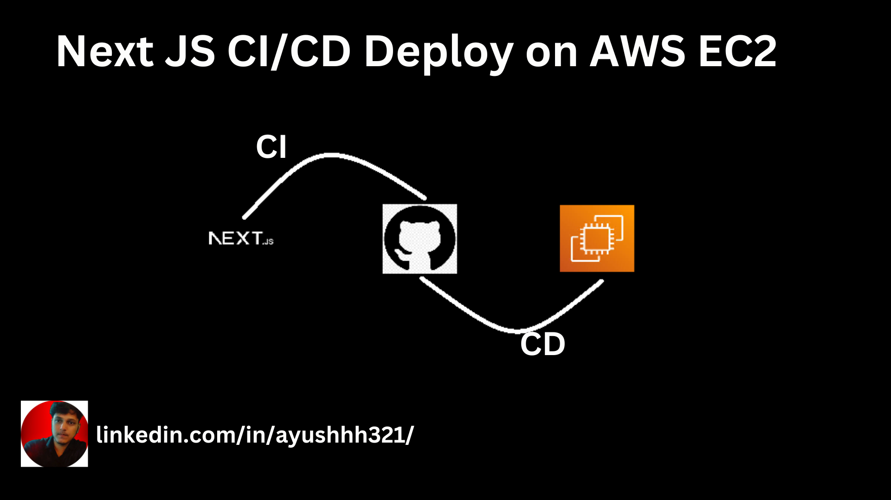

<p align="center">
  <a href="http://nestjs.com/" target="blank"></a>
</p>                  
                                       
[circleci-image]: https://img.shields.io/circleci/build/github/nestjs/nest/master?token=abc123def456
[circleci-url]: https://circleci.com/gh/nestjs/nest


## Description

[Nest](https://github.com/nestjs/nest) framework TypeScript starter repository.

## Installation

```bash
$ npm install
```

## Running the app

```bash
# development
$ npm run start

# watch mode
$ npm run start:dev

# production mode
$ npm run start:prod
```

## Test

```bash
# unit tests
$ npm run test

# e2e tests
$ npm run test:e2e

# test coverage
$ npm run test:cov
```

## Contribution

Contributions to this repository are welcome! If you have additional documentation, code examples, or tasks that you would like to share, feel free to submit a pull request.

## Feedback

Your feedback is valuable! If you have suggestions for improving existing content or ideas for new additions, please open an issue or reach out to the repository maintainers. If you have any other feedbacks, you can reach out to us at ayushguptab6@gmail.com or +91 7324829593


## Connect with Me
<p>

 <a href="https://x.com/hypo_sucks" target="blank"></a>
  &nbsp;&nbsp;
  	<a href="https://www.linkedin.com/in/ayushhh321/" target="blank"></a>
  &nbsp;&nbsp;
 <a href="https://instagram.com/ayushgupta.73" target="blank"></a>
